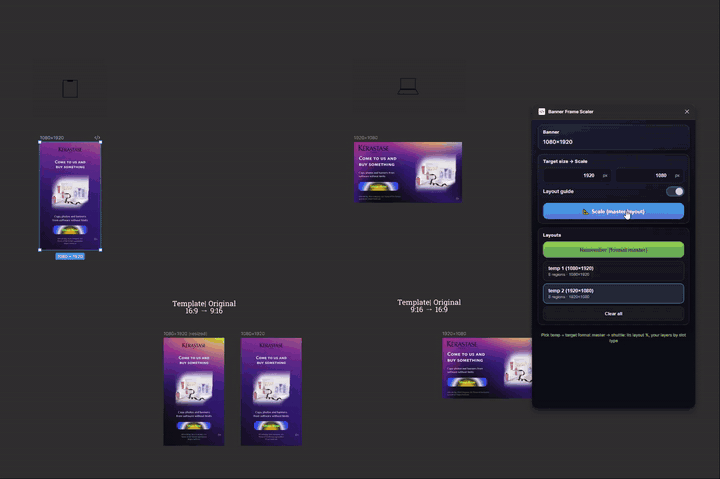
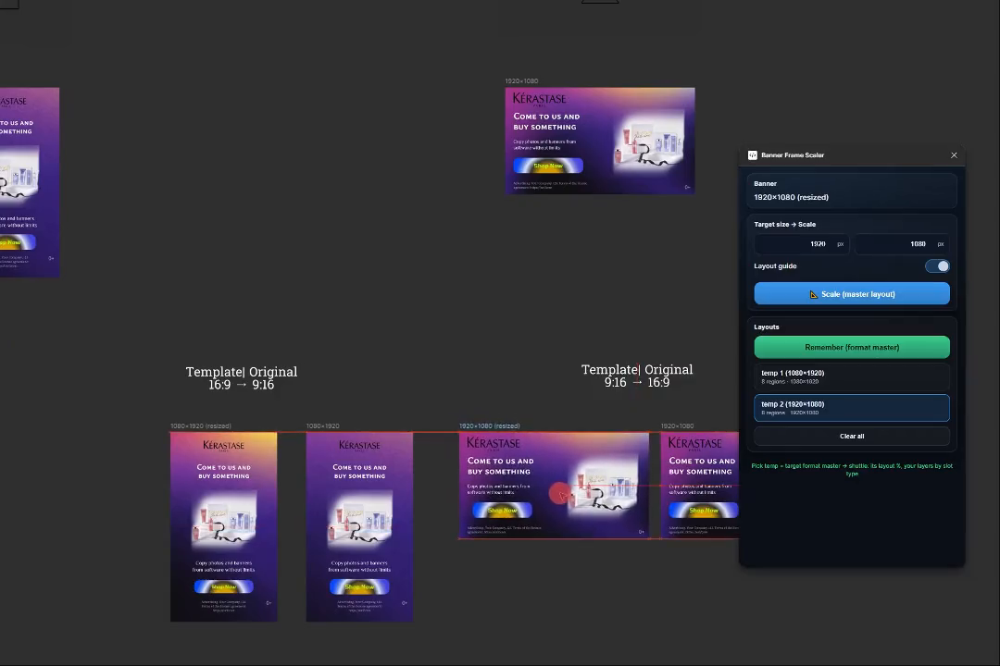
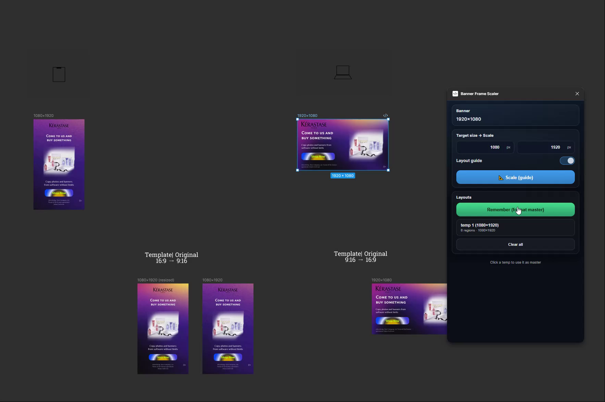
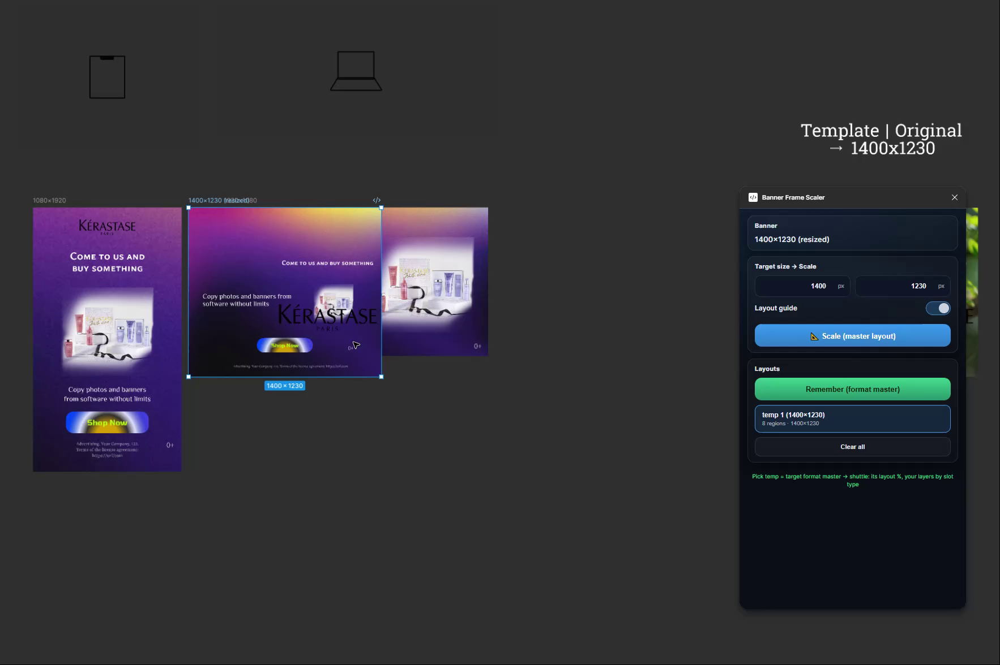
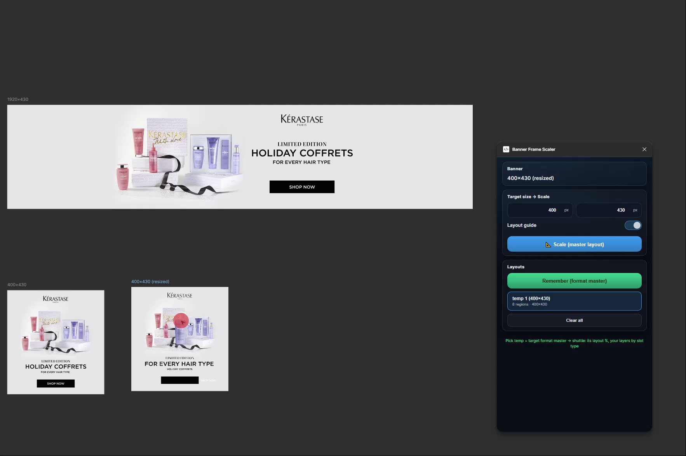
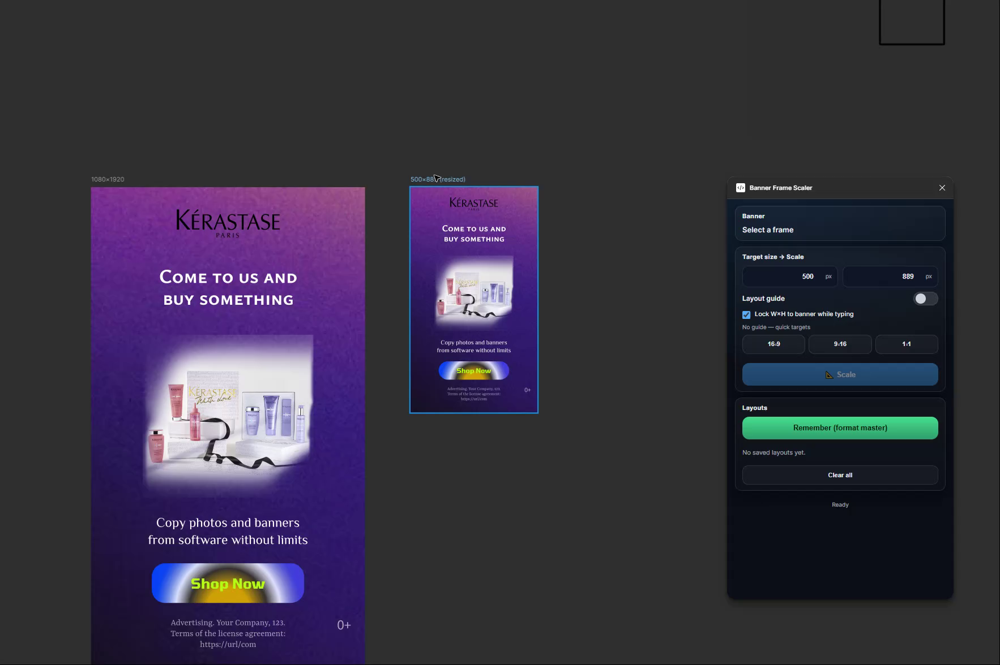
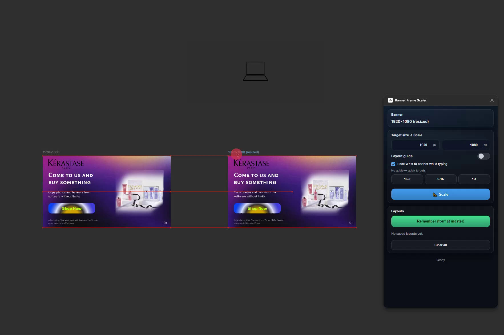
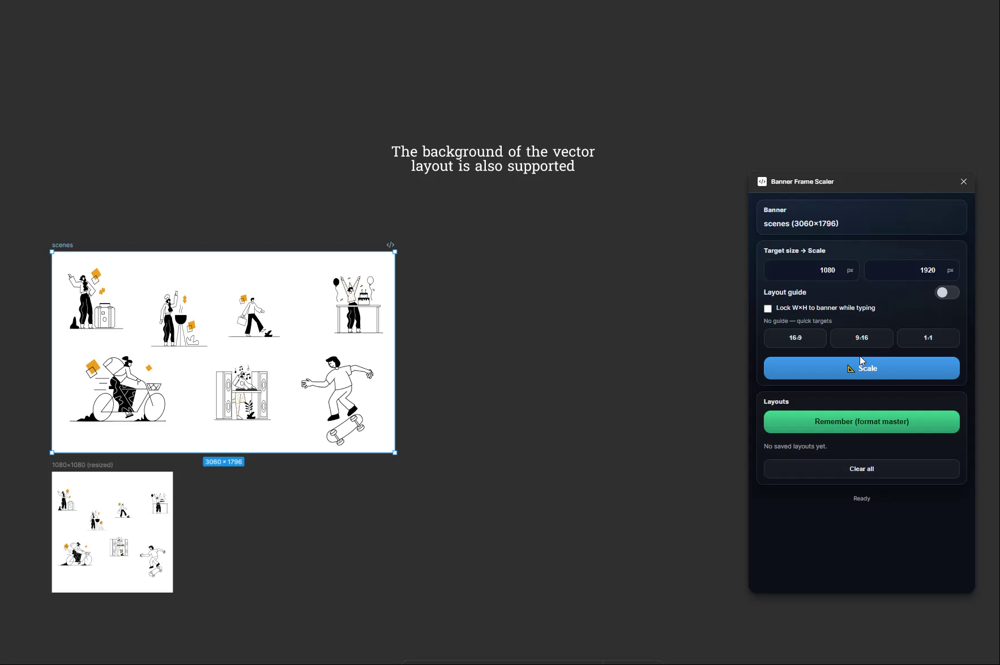

# Banner Frame Scaler

### The problem

In ad production, one banner gets adapted to **10–15 target sizes**. Designers do it by hand — Figma's built-in Scale just applies a uniform factor:

- Text becomes unreadable
- Elements shift and overlap
- Backgrounds distort

Every size requires **manual fixing**. Hundreds of banners per campaign = hours of repetitive work.

### What I built

A **Figma plugin** that does this in **one click per size:**

- Background stretches to fill — intelligently, not uniformly
- Text stays readable
- Buttons, logos, and layout stay in the right place

Three modes — from quick resize to full cross-format adaptation with **master-banner templates**: define a layout once, apply it to any banner automatically.

  
  
  
  

---

## Demo

  
   
  Master banner workflow: one click → layout adapts to target size. <a href="https://youtu.be/JCN9pqSKNCM"><b>Full demo on YouTube</b></a> (~3 min)

Six cases — no voiceover, each is **before → action → result** inside Figma.

  
   
  <a href="https://youtu.be/JCN9pqSKNCM"><b>▶ Watch all six cases on YouTube</b> (~3 min)</a>

### Individual cases

> Screenshots below are single frames from the videos — click any image to watch the full case on YouTube.

<b>1) Master banner — core case</b> · 46 sec

  
   <a href="https://youtu.be/-D247wvEzm4"><b>▶ Watch on YouTube</b> · 46 sec</a>

**The flagship workflow:**
- Two reference banners created: **16:9** (1920×1080) and **9:16** (1080×1920)
- Each gets **Remember** → plugin saves the slot map
- A different banner is selected → target size chosen → **Scale (saved layout)**
- Result: logo in header, CTA at bottom, disclaimer and age rating in correct slots
- Then the same flow **in reverse** — 9:16 → 16:9 — to show it works both directions

<b>2) Unusual template support</b> · 38 sec

  
   <a href="https://youtu.be/aYBxoKWKi5s"><b>▶ Watch on YouTube</b> · 38 sec</a>

**Non-standard template** (1400×1230) — unusual dimensions, atypical layer nesting:
- Engine uses existing 16:9 and 9:16 masters via **cross-master layout**
- Slots matched by **semantic type** (title, logo, button) despite completely different structure
- Shows the engine is **not hardcoded** to specific banner formats

<b>3) Edge cases — complex aspects</b> · 25 sec

  
   <a href="https://youtu.be/OLFq4mTBKjE"><b>▶ Watch on YouTube</b> · 25 sec</a>

**Extreme aspect change:** ultra-wide 1920×430 → near-square 400×430
- Most scaling tools break completely at this ratio
- Engine rearranges content into the new shape using **Remember layout**
- **Known issue visible:** CTA button renders as a black bar — honest edge case, being tracked

<b>4) Cluster scaling — portrait 9:16</b> · 33 sec

  
   <a href="https://youtu.be/gkj9jYPyJOY"><b>▶ Watch on YouTube</b> · 33 sec</a>

**Pure cluster mode** — no Remember, no layout guide:
- 9:16 banner (1080×1920) → smaller portrait (500×889) → back to full size
- Background fills target, content stays proportional, text remains readable
- Two resize steps from the same source — shows the engine is **idempotent**

<b>5) Cluster scaling — landscape 16:9 → multi-format</b> · 46 sec

  
   <a href="https://youtu.be/USS-ExfiXm8"><b>▶ Watch on YouTube</b> · 46 sec</a>

**Multiple targets from one source** — all without Remember:
- 16:9 (1920×1080) → another 16:9 → **1:1** (1080×1080) → **9:16** (1080×1920)
- Just the base cluster scaling engine
- Consistent results **across all orientations**

<b>6) Vector example</b> · 44 sec

  
   <a href="https://youtu.be/wA1rhzN6Brs"><b>▶ Watch on YouTube</b> · 44 sec</a>

**Pure vector layout** — no photos, only paths and shapes:
- Resized from landscape → 1:1 → portrait → back
- Shapes scale cleanly, paths stay sharp, no raster artifacts
- **Note:** at extreme aspect changes, illustrations appear small with empty space — expected when preserving proportions. A **per-format master** would fill the frame in production

See also: [Demo guide with chapter descriptions](./WATCH_DEMO.md)

## How it works

Two scaling systems controlled by one toggle: **Layout guide OFF** = cluster scaling, **Layout guide ON** = semantic layout engine.

### Cluster scaling (Layout guide OFF)

Analyzes a frame's children and partitions them into **spatial clusters:**

| Layer type | Strategy |
|---|---|
| **Background** (detected automatically — never by layer name) | Stretch non-uniformly to fill target |
| **Content clusters** (text, buttons, images, logos) | Scale proportionally as rigid groups |
| **Nested frames** | Recursive pass — own coordinate space per level |
| **Typography** | Conservative sizing, per-range mixed styles, fallback font |
| **Visual cleanup** | Corner radius recalculated, sub-pixel positions rounded |

Works on **any Figma frame**. Deterministic, no AI/ML, runs inside the Figma plugin sandbox.

**Lock W×H to banner** checkbox (default on): width and height stay proportional to the source as you type. Uncheck for arbitrary W×H. Quick **16∶9 / 9∶16 / 1∶1** buttons set fixed presets.

### Semantic layout engine (Layout guide ON)

When the Layout guide toggle is on, the engine classifies elements and repositions them semantically — not just scales them. This is **one system with two data sources:**

**1. Built-in presets (fallback)** — when you haven't saved any master yet, the engine falls back to bundled layout rules for common production sizes. No setup needed — just pick a target size and hit Scale. Useful for a quick result, but generic.

| Step | What happens |
|---|---|
| **Classify** | 8 semantic element types (title, logo, button, background, disclaimer, age rating, description, other) detected via spatial/visual heuristics — **zero layer-name dependency** |
| **Match** | Aspect-aware preset selection from **built-in production sizes** |
| **Remap** | Each element mapped to its target slot with type-aware matching |

**2. Master banner / Remember (the core feature)** — instead of built-in rules, **you** define the layout. Build a reference banner for each format (16:9, 9:16, 1:1, etc.), hit **Remember** — the plugin saves **your** layout. The engine now uses your master instead of the built-in fallback. Masters live in the current session — hit Remember once per format and scale as many banners as you need.

| Capability | How it works |
|---|---|
| **Saved layout (strict)** | Same frame as the remembered template → slots applied directly |
| **Master layout (cross)** | Different frame → slots matched by **semantic type** (title↔title, logo↔logo), not by tree structure or names |
| **Chain scaling** | After scale, the active temp **rebinds to the output**. Select the result, set new W×H, Scale again — continuous pipeline |
| **Typography from master** | Font properties survive aspect changes — text stays readable and proportional |
| **Shape hints** | Radius, stroke, opacity stay consistent — buttons and badges don't distort |

**Cross-master matching** handles extreme aspect ratio differences (e.g. 970×250 → 9:16) using multiple pairing strategies that adapt based on how different the source and target shapes are. Each element type gets the most reliable matching approach for that level of aspect divergence.

---

## What makes this non-trivial

> Problems Figma's built-in tools don't solve:

| Problem | Engine solution |
|---|---|
| Background stretches, content shouldn't | Cluster partitioning — separate scale strategies per cluster |
| Text becomes unreadable after resize | Font pre-loading + conservative sizing + per-range mixed style handling + minimum sizes |
| Nested groups break | Recursive scaling with per-level coordinate spaces |
| Corner radius distorts | Recalculated proportionally |
| Aspect ratio change destroys layout | Semantic detection → guide-based repositioning (not just scaling) |
| Cross-format template breaks at extreme aspects | Multi-strategy matching — approach adapts per element type and aspect divergence |
| Figma fights computed positions | Constraints and layout modes neutralized before processing |
| Instance children are read-only | Instance tree walked for detection, mutations only on the container |
| Export settings stale after resize | Export constraints auto-synced to match the new frame dimensions |

<b>Technical Q&A (for engineers)</b>

 

**Is it deterministic? Any AI/ML?**
Fully deterministic. No AI/ML at runtime. Spatial algorithms + heuristics only.

**Does the engine rely on layer names?**
No. Classification relies on spatial and visual properties — never on layer names. Names are stored for UI display only.

**How do you handle text with mixed styles?**
All required fonts pre-loaded via `figma.loadFontAsync()`, including inside INSTANCE children. Mixed styles handled per-range. Font failure → safe fallback.

**How does cross-master matching work at extreme aspect ratios?**
Multiple strategies activate based on how different the source and target shapes are — each element type gets the most reliable pairing approach. Best explained in a live demo.

**What about auto-layout and instances?**
Auto-layout intentionally disabled (output is absolute positioning). Instance children are walked for detection and pairing, but only the container is resized.

**Where does it run?**
Fully inside the **Figma plugin sandbox**. No external servers, no offline compute.

Full FAQ: [FAQ.md](./FAQ.md)

---

## Scope

| | |
|---|---|
| **Codebase** | Complex TypeScript architecture (Figma plugin sandbox) |
| **Pipeline** | Multi-stage: analysis → scaling → layout postprocessing |
| **Semantic types** | 8 element types via spatial/visual heuristics (zero name dependency) |
| **Guide presets** | Built-in production sizes (data-driven, extensible) |
| **Remember system** | Per-format master templates — define once, apply to any banner |
| **Cross-master** | Multi-strategy matching for decor, structural elements, and extreme aspect changes |
| **Node types** | FRAME, GROUP, COMPONENT, INSTANCE, TEXT, VECTOR, ELLIPSE, shapes |
| **Runtime** | Fully inside Figma plugin sandbox — no external servers, no AI inference |

---

## Growth potential

The cluster engine is **frame-agnostic** — works on any Figma subtree. The guide system is **data-driven** — new presets = new layout types, no engine changes. The Remember system is **format-agnostic** — any aspect ratio, any slot structure.

| Use case | What changes | Engine reuse |
|---|---|---|
| **Presentation slides** | Master slide → landscape / portrait / square | Cluster scaling + Remember per format |
| **Email templates** | Master → desktop / mobile variants | Cluster scaling + semantic repositioning |
| **Social media** | One creative → all platform sizes | Direct — same as banner workflow |
| **Landing pages** | Hero section → responsive breakpoints | Cluster scaling for structured sections |
| **Design system assets** | Component → multiple density/size targets | Cluster scaling + component-aware extensions |

<b>Architecture-level extensions</b>

 

- **Persistent master templates** — save Remember masters across sessions so you define a layout once and reuse it permanently (currently session-only)
- **Component-aware scaling** — leverage Figma component metadata for smarter per-node decisions
- **Auto-layout reconstruction** — preserve or rebuild auto-layout after scaling
- **Cross-format export** — adapt pipeline output to HTML/CSS or PDF
- **ML-assisted guide generation** — learn optimal slot positions from production data
- **Batch mode** — apply one master's temps to a queue of banners automatically

---

## Honest limitations

- Heuristic semantic detection can misclassify unusual layouts (mitigated by Remember — explicit slot map)
- Auto-layout disabled during processing (absolute positioning output)
- Instance internals are read-only (Figma API constraint — walked for detection, not mutated)
- Cross-master matching degrades gracefully but can mismatch on banners with very different slot counts

---

## Source code

This repo contains **demo assets and documentation**. Full source available privately on request.

**How to evaluate:** watch the demo → expand the technical Q&A → [reach out](https://github.com/ilya-makarov-dev) for a live screen-share with edge cases.

